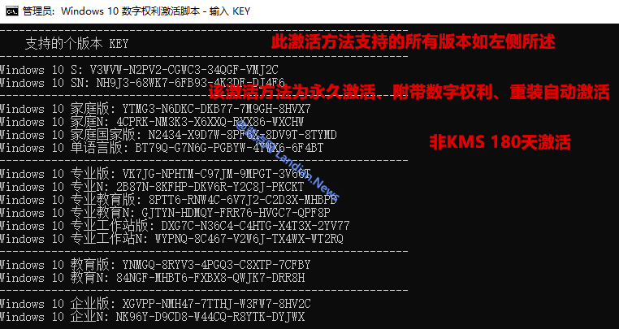
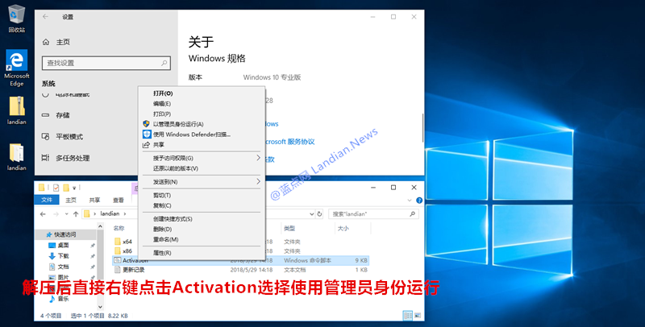
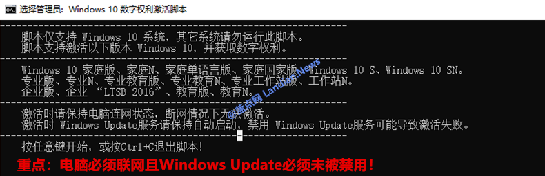
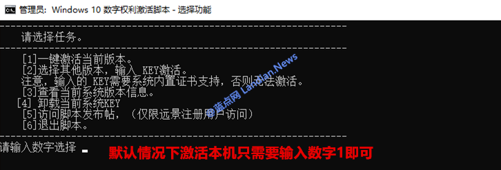
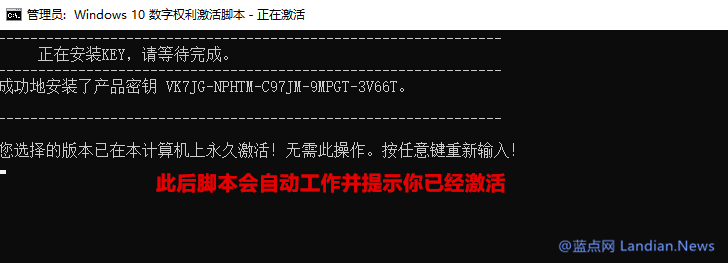

Current v-1.0

日前在国外科技论坛有大神发布名为HWIDGEN数字激活工具，该激活工具几乎秒杀所有版本Windows 10系统。
我们知道Windows 10现在激活后会带有数字权利，数字权利可以在我们重装系统后自动激活无需再次执行激活。
而HWIDGEN激活工具正是直接获取数字激活权利进行永久性激活，这种方法激活后用户下次安装同样无需激活。

> 数字权利获取起使用教程：

此工具使用过程非常简单大家按照蓝点网制作的截图说明操作即可 , 理论上只要满足激活条件均可成功执行激活。

激活条件1：系统最好是微软原版系统且必须开启Windows Update服务 , 如果没有开启该服务会导致激活失败。

激活条件2：如果你从第三方下载的精简版或者修改的系统 ,  可能更新服务被禁用无法激活，建议安装原本系统。

激活条件3：电脑必须已经正常联网才可使用此工具执行激活获取数字权利 ,  如无法联网则无法使用本工具激活。

> HWIDGEN获得数字权利的激活原理：

说到激活原理自然先得继续介绍Windows 10系统的数字激活权利，所谓数字权利即与已系统绑定的激活许可证。
默认情况下当Windows 10被激活后会自动生成与硬件编号对应的许可证，该许可证会存储到微软公司服务器上。
当系统重新安装时自动将硬件编号提交给微软检索对应的许可证，若许可证符合则系统自动激活无需用户再操作。
至于HWIDGEN是如何通过修改系统内核数据来激活系统就是技术问题了，有兴趣的网友可以研究源代码。

在激活系统后同时连接微软将硬件编号对应激活许可证上传，最终对于用户来说系统在激活的瞬间就有数字权利。
本方法激活的操作系统没有任何副作用，如果你登录微软账号的话就会自动将数字许可证绑定到你的微软账号上。
当然不论是否登录账号都不会影响数字许可证，即下次重装系统输入对应版本的激活密钥后系统将自动执行激活。

[@vyvojar](https://github.com/vyvojar/slshim) [@黯然 KING](http://bbs.pcbeta.com/viewthread-1786788-1-1.html)